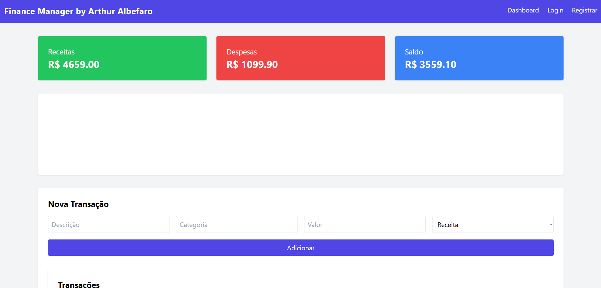

# Finance Manager Pro

Sistema de controle financeiro desenvolvido com:

- FastAPI
- SQLAlchemy
- MySQL
- Jinja2
- Chart.js
- TailwindCSS

## Preview

## Funcionalidades

- Cadastro e login de usuários
- Registro de receitas e despesas
- Dashboard com gráfico por categoria
- Cálculo automático de saldo

## Como executar

pip install -r requirements.txt
uvicorn app.main:app --reload

## Observações

Esse projeto foi inteiramente desenvolvido por mim, espero que goste do meu trabalho!
Caso tenha se interessado, entre em contato comigo pelo meu e-mail:
arthuralbefaroec@gmail.com
